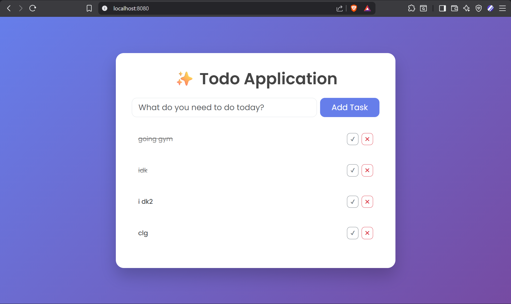

## 📸 Preview

# 📝 Spring Boot Todo Application

A simple and clean Todo web application built using Spring Boot and Thymeleaf.

## 🚀 Features
- Add new tasks
- Mark tasks as completed
- Delete tasks
- Clean modern UI
- MVC architecture

## 🛠 Tech Stack
- Java
- Spring Boot
- Thymeleaf
- Bootstrap 5
- Maven

## 📂 Project Structure
- Controller Layer
- Service Layer
- Repository Layer
- Templates (Thymeleaf)

## ▶️ How to Run

1. Clone the repository
2. Open in IntelliJ
3. Run `TodoApplication.java`
4. Visit: `http://localhost:8080`

## 👨‍💻 Author
Raunak Jha
